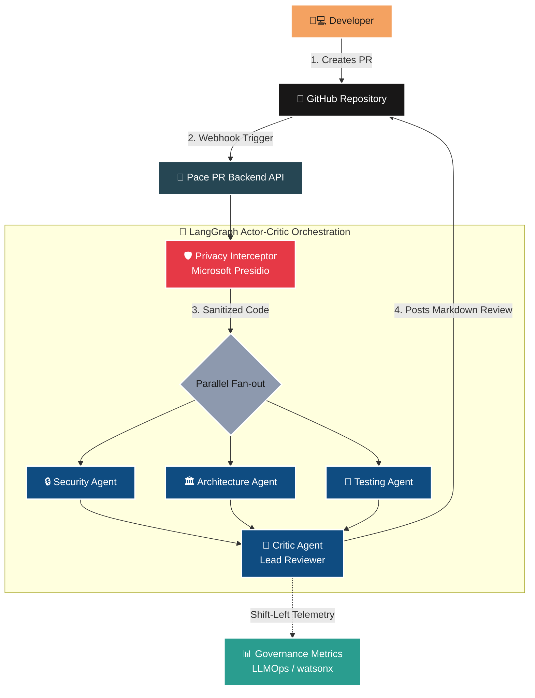

# 🚀 Pace PR Orchestrator (IBM Bob 2.0 Hackathon)

A Multi-Agent Code Review Orchestrator focused on **AppSec, AI Governance (LLMOps), and Scalability**, designed to act as a consulting engineer on Pull Requests, strictly adhering to GitHub's 2-minute SLA.

---

## 🏗️ System Architecture



## 🏆 Competitive Advantage (Why is this project unique?)

Most AI-based tools on the market suffer from Alert Fatigue (false positives), PII leakage, and blow up infrastructure budgets. The Pace PR Orchestrator was designed to be Enterprise-Ready, shielding the pipeline across five pillars:

### 1. Actor-Critic Architecture (Hallucination Reduction)

We use LangGraph to orchestrate a 4-stage pipeline. Three specialist sub-agents (Security, Architecture, Testing) analyze the code in parallel (Fan-out via asyncio). The result converges to a 4th agent, the Lead Reviewer (Critic). The Critic cross-references the analyses, filters LLM hallucinations, and only approves verifiable findings, reducing developer's false positive fatigue.

### 2. Privacy-Preserving Pipeline (Microsoft Presidio)

No raw code is sent to the LLM. The system features an interceptor node equipped with Microsoft Presidio (NLP) and Regex. It sanitizes the diff, masking secrets, emails, and IPs ([REDACTED_PII]). This ensures native compliance with GDPR, LGPD, and ISO 27001 in Code Review workflows.

### 3. AppSec & Zero-Trust Defense

- **Deterministic Hybrid Security:** Before the AI asserts its opinion on security, the system runs local subprocesses (Gitleaks and Trivy) on the raw code. The infallible result from the scanners is passed to the LLM to consolidate the report.
- **Pydantic Firewall & Explainability:** We abandoned the fragile json.loads. The agents' output is validated against Pydantic contracts. The system requires the AI to reference the filename, the exact line of the error, and a confidence_score. If the AI fails to prove it, the output is rejected (Fail-Closed).
- **OWASP Prompt Injection Shield:** The user's payload is isolated in strict XML tags (`<UNTRUSTED_PAYLOAD>`), mitigating adversarial attacks hidden in the PR's code.

### 4. SRE & FinOps Guardrails

- **DoW (Denial of Wallet) Protection:** The system filters automatic lockfiles and truncates massive diffs (MAX_DIFF_LENGTH = 12,000), preventing Context Window overflow and astronomical cloud bills.
- **Webhook Backpressure:** An asyncio.Semaphore acts as a turnstile, controlling global concurrency and returning HTTP 503 (Retry Signal for GitHub) during PR spikes, preventing the exhaustion of the provider's Rate Limit.
- **Fallback Model (Circuit Breaker):** Integration with Tenacity. If the primary API goes down or exhausts retries, the pipeline silently transfers the load to a backup LLM (LLM_FALLBACK_API_URL).

### 5. Shift-Left Observability & IBM watsonx.governance

- **Real-Time Governance Metrics:** Instead of relying on external third-party dashboards, we embedded LLMOps directly into the developer's workflow. Every review automatically calculates and injects Pipeline Latency, Mean Confidence Score, and Estimated Token Cost directly into the GitHub PR footer.
- **Corporate Audit (Hook):** The architecture exposes a native mount point (emit_governance_telemetry) designed to transmit the decision tree directly to IBM watsonx.governance, enabling factsheets and continuous compliance in IBM Cloud environments.

## 🛠️ How to Run (Deployment)

The system features optimized Docker containers and an easily accessible Makefile.

1. Clone the repository and create your `.env` file:

```bash
cp .env.example .env
# Fill in your GITHUB_TOKEN, LLM_API_KEY, and LLM_URL
```

2. Execute via Makefile:

```bash
make run
```

3. Test on GitHub: Point an Ngrok tunnel to port 8000 and configure the `/webhook` route in your test repository on GitHub.